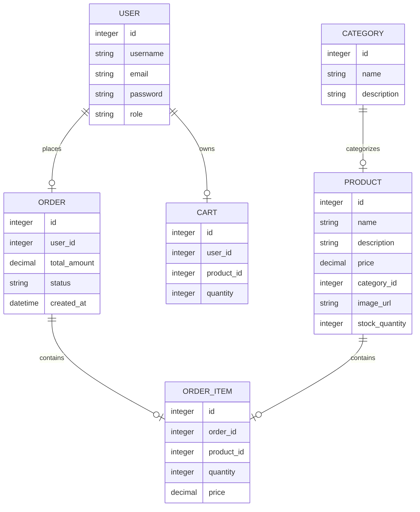
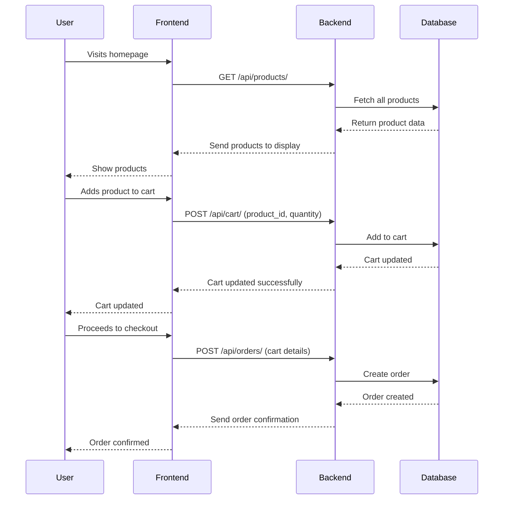
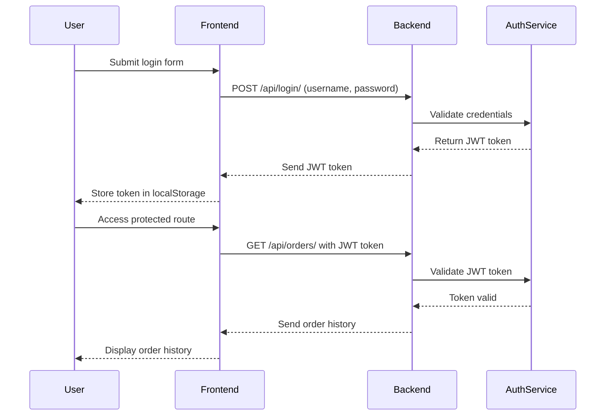

## Design

### **Database Schema (ER Diagram)**

```mermaid
erDiagram
    USER {
        integer id
        string username
        string email
        string password
        string role
    }
    CATEGORY {
        integer id
        string name
        string description
    }
    PRODUCT {
        integer id
        string name
        string description
        decimal price
        integer category_id
        string image_url
        integer stock_quantity
    }
    CART {
        integer id
        integer user_id
        integer product_id
        integer quantity
    }
    ORDER {
        integer id
        integer user_id
        decimal total_amount
        string status
        datetime created_at
    }
    ORDER_ITEM {
        integer id
        integer order_id
        integer product_id
        integer quantity
        decimal price
    }

    USER ||--o| CART : owns
    USER ||--o| ORDER : places
    ORDER ||--o| ORDER_ITEM : contains
    PRODUCT ||--o| ORDER_ITEM : contains
    CATEGORY ||--o| PRODUCT : categorizes
```

---

### **Flow of Interactions**

#### **Frontend to Backend API Flow**:

```mermaid
sequenceDiagram
    participant User
    participant Frontend
    participant Backend
    participant Database

    User->>Frontend: Visits homepage
    Frontend->>Backend: GET /api/products/
    Backend->>Database: Fetch all products
    Database-->>Backend: Return product data
    Backend-->>Frontend: Send products to display
    Frontend-->>User: Show products

    User->>Frontend: Adds product to cart
    Frontend->>Backend: POST /api/cart/ (product_id, quantity)
    Backend->>Database: Add to cart
    Database-->>Backend: Cart updated
    Backend-->>Frontend: Cart updated successfully
    Frontend-->>User: Cart updated

    User->>Frontend: Proceeds to checkout
    Frontend->>Backend: POST /api/orders/ (cart details)
    Backend->>Database: Create order
    Database-->>Backend: Order created
    Backend-->>Frontend: Send order confirmation
    Frontend-->>User: Order confirmed
```

#### **Authentication Flow**:

```mermaid
sequenceDiagram
    participant User
    participant Frontend
    participant Backend
    participant AuthService

    User->>Frontend: Submit login form
    Frontend->>Backend: POST /api/login/ (username, password)
    Backend->>AuthService: Validate credentials
    AuthService-->>Backend: Return JWT token
    Backend-->>Frontend: Send JWT token
    Frontend-->>User: Store token in localStorage
    User->>Frontend: Access protected route
    Frontend->>Backend: GET /api/orders/ with JWT token
    Backend->>AuthService: Validate JWT token
    AuthService-->>Backend: Token valid
    Backend-->>Frontend: Send order history
    Frontend-->>User: Display order history
```

---