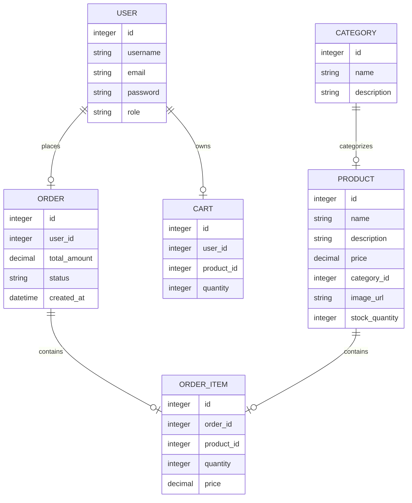
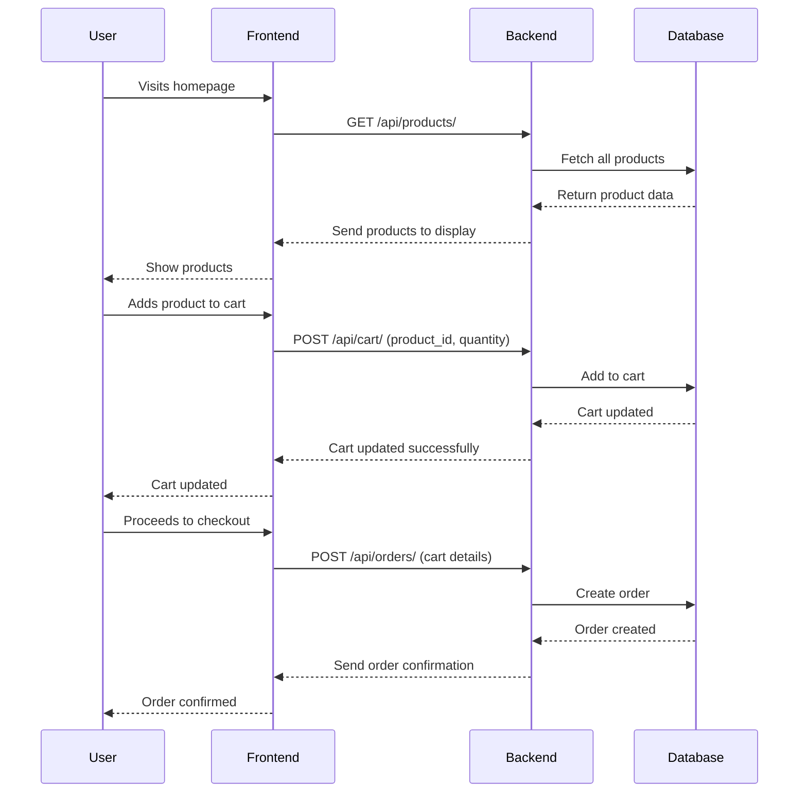
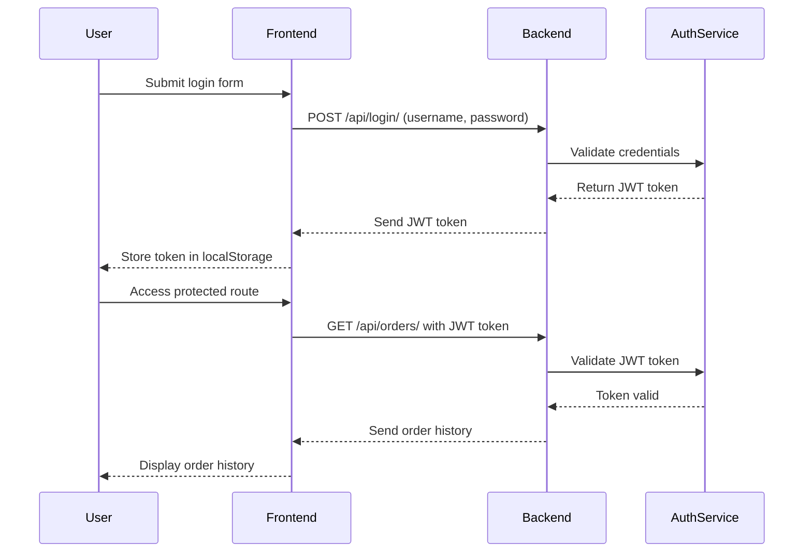

## **Online Shop System Design(IN PROGRESS)**

### **1. Overview**
This project provides an **Online Shop** built using **React** for the frontend, **Django** for the backend, and **Django REST Framework (DRF)** for creating APIs. The system enables users to browse products, manage a shopping cart, and place orders, with authentication handled via JWT tokens.

---

### **2. Key Features & Functionalities**

#### **Frontend (React)**:
1. **Product Display**:
   - **Product List**: A paginated list of products, with the ability to filter by category and search.
   - **Product Detail Page**: Detailed view of each product, showing description, price, and image.

2. **Shopping Cart**:
   - Add products to the cart and adjust quantities.
   - Show cart summary (total price and product list).
   - Persist cart data locally or associate it with user accounts if logged in.

3. **User Authentication**:
   - Login and Registration forms.
   - JWT Authentication for secure access to protected routes.
   - Password reset functionality via email.

4. **Checkout & Order Processing**:
   - Checkout page where users provide shipping details and review their order.
   - Integration with payment systems (e.g., **Stripe** or **PayPal**) to process payments.
   - Display order confirmation and success/failure messages.

5. **Order History**:
   - Users can view their past orders, including product details, price, and status.

---

#### **Backend (Django + DRF)**:
1. **Product Management**:
   - CRUD (Create, Read, Update, Delete) functionality for managing products.
   - Categories for grouping products (e.g., electronics, clothing).
   - Upload and manage product images.

2. **User Authentication**:
   - **JWT** based user authentication for secure login and registration.
   - Role-based access for users and admins (e.g., admin can manage products).

3. **Shopping Cart**:
   - Store cart items associated with a user or session.
   - Allow CRUD operations on cart items (add, remove, update quantity).

4. **Order Management**:
   - Users can place orders, storing product, quantity, and total price information.
   - Order status management (e.g., pending, shipped, delivered).
   - Integration with payment APIs (Stripe/PayPal) for payment processing.

5. **Admin Panel**:
   - Admin users can manage products, users, and view order history.
   - Admins can update the status of orders and monitor payments.

---

### **3. System Architecture & Flow**

#### **Frontend Architecture (React)**:
- **React Components**:
  - **ProductList**: Displays a paginated list of products.
  - **ProductDetail**: Shows detailed information for each product.
  - **Cart**: Manages the items added to the shopping cart.
  - **Checkout**: Handles user’s order information and payment.
  - **OrderHistory**: Displays past orders for the user.

- **State Management**:
  - **React Context API** or **Redux** to manage global states like cart data, user authentication, and orders.

- **Routing**:
  - **React Router** for page navigation between the homepage, product details, cart, and checkout.

#### **Backend Architecture (Django + DRF)**:
- **Django Models**:
  - **Product**: Contains fields like name, price, description, category, and stock.
  - **Category**: For organizing products into categories.
  - **User**: User accounts with fields for login, email, and role.
  - **Cart**: Stores cart items with links to products and quantities.
  - **Order**: Stores order details like products, total price, user, and status.

- **API Endpoints**:
  - **POST /api/login/**: Authenticate and return a JWT token.
  - **POST /api/register/**: Register a new user.
  - **GET /api/products/**: Fetch a list of all products.
  - **GET /api/products/{id}/**: Fetch details for a single product.
  - **POST /api/cart/**: Add items to the cart.
  - **DELETE /api/cart/{id}/**: Remove items from the cart.
  - **POST /api/orders/**: Create an order after checkout.

- **JWT Authentication**:
  - Protect routes like order history, cart, and checkout with JWT tokens, requiring the token to access certain endpoints.

---

### **4. Database Schema (ER Diagram)**

---

### **5. Flow of Interactions**

#### **Frontend to Backend API Flow**:

#### **Authentication Flow**:

---

### **6. Technology Stack**
- **Frontend**: 
  - **React** (with React Router, Context API/Redux)
  - **Axios** for API calls
  - **Stripe/PayPal** for payment integration

- **Backend**: 
  - **Django** (for user management, product CRUD, and order handling)
  - **Django REST Framework (DRF)** (for creating RESTful APIs)
  - **JWT** (for user authentication)

- **Database**: 
  - **PostgreSQL**
